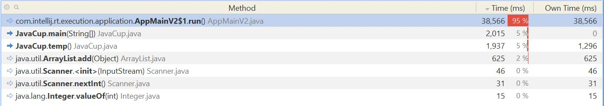
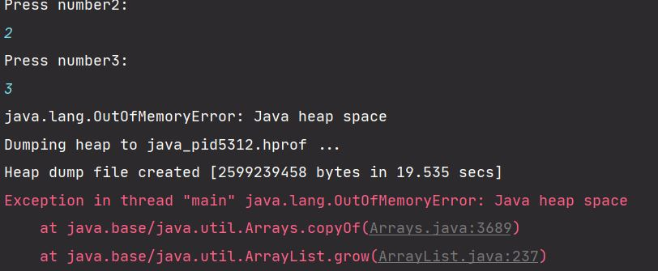
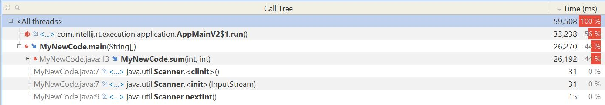
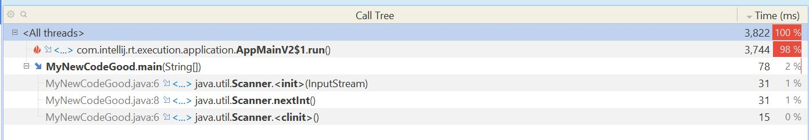

# آزمایش پنجم آز مهندسی نرم‌افزار

## سیدمحمدصادق طبائیان - 98105868

## عبدالصمد حقیری - ?

آدرس مخزن پروژه: https://github.com/GildedJson/SE-AZ-5

تابع temp بیشترین منابع را مصرف می‌کند:

در حدی که حافظه‌ی جاوا جواب نمی‌دهد:

&nbsp;

&nbsp;

کلاس MyNewCodeBad کد جدیدی است که نوشته شد. این فایل در پروژه موجود است و الگوریتم جمع را به صورت بازگشتی پیاده می‌کند. مصرف CPU را در شکل زیر مشاهده می‌کنید:

کد اصلاح شده در کلاس MyNewCodeGood موجود است. در این کلاس الگوریتم جمع اصلاح شده است. مصرف CPU را در شکل زیر مشاهده می‌کنید.

مصرف دیگر منابع تفاوت قابل توجهی نشان نمی‌دهد.

